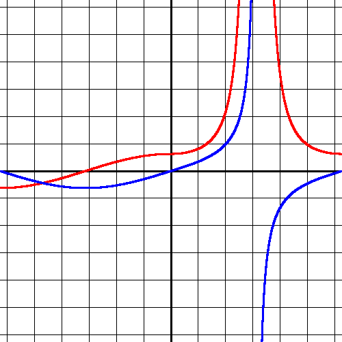

DifferentiateMe
===

_"To appreciate me, differentiate me; From these phoney, little fishy and sissy fake G's"_ - Eminem (So Bad)

About
---
DifferentiateMe is a math expression library with a graphing utility.

Features
---
Current:
- Create, combine, graph, simplify, differentiate, and evaluate expressions:
  - Arithmetic
  - Exponential
  - Logarithmic
  - Trigonometric
  - Inverse Trigonometric
  - Variable
  - Conditional
  - Modulo
  - Random number
  - Piecewise
  - Boolean

Future:
- Better reducing/simplifying of expressions
- Multiple variables
- GUI for building expressions and graphing them
- See the [issues](https://github.com/handrinp/DifferentiateMe/issues) page for more unimplemented features

Dependencies
---
In order to build this, you need Apache Maven installed.
The output is a JAR, so you just need a JDK (1.8 or higher) to run it.

Building
---
Build the app with `mvn clean package`

Running
---
Run the app with `java -jar target/DifferentiateMe.jar`

Example
---
For example, consider the blue graph f(x) = {tan(x), if (x > 0.0)}, {sin(x), if (x <= 0.0)}.
The derivative, f'(x) is plotted in red.

